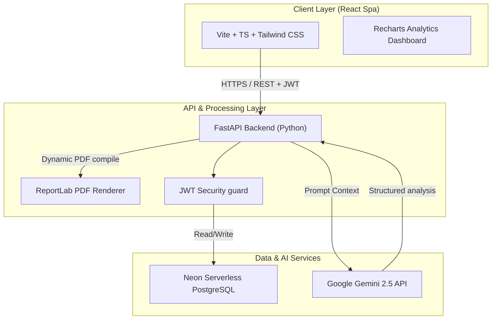
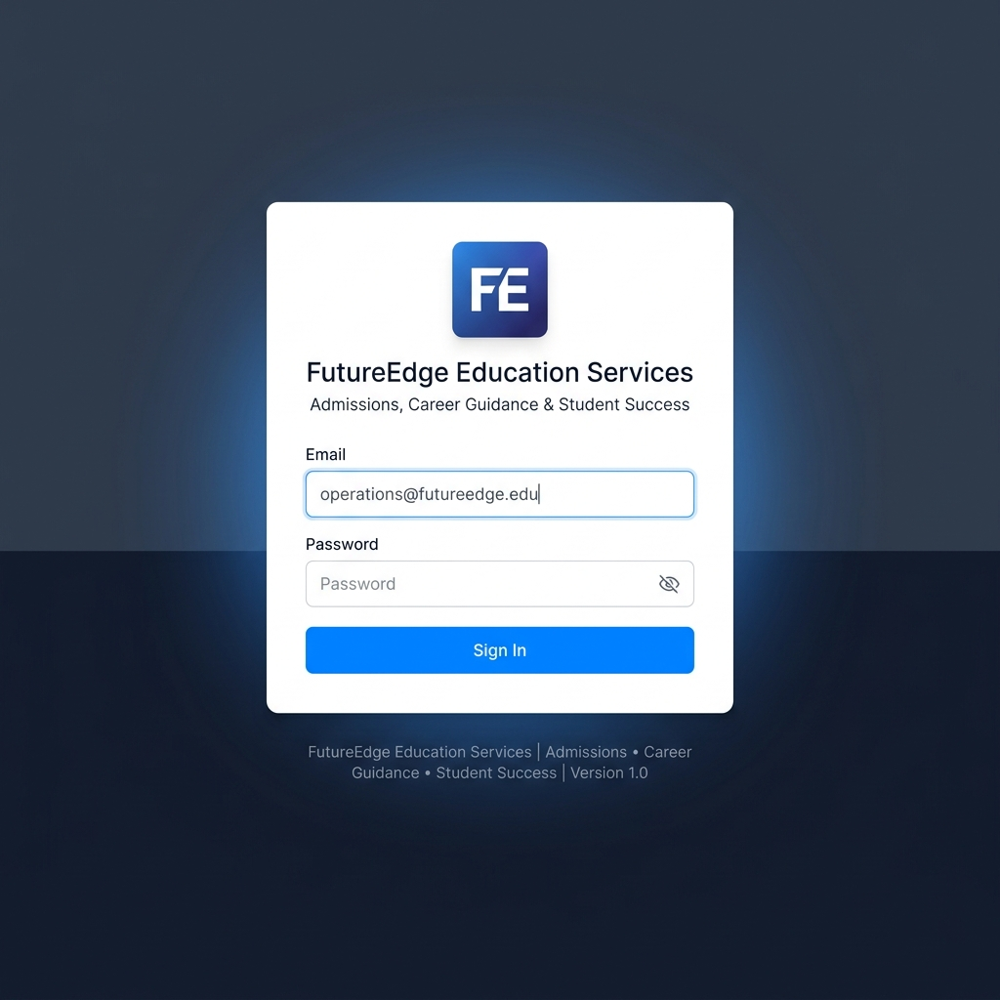
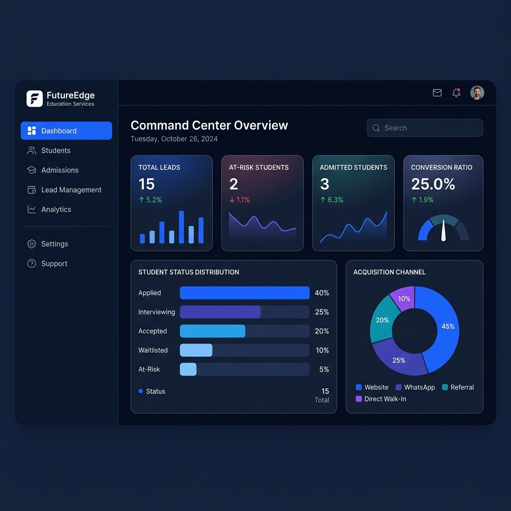
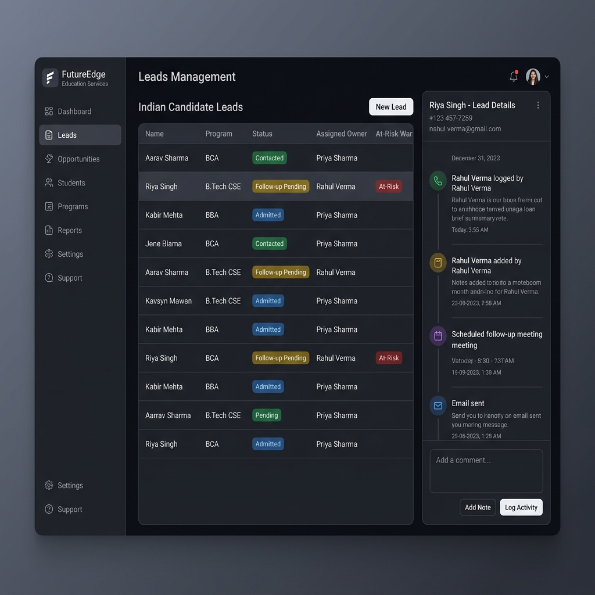
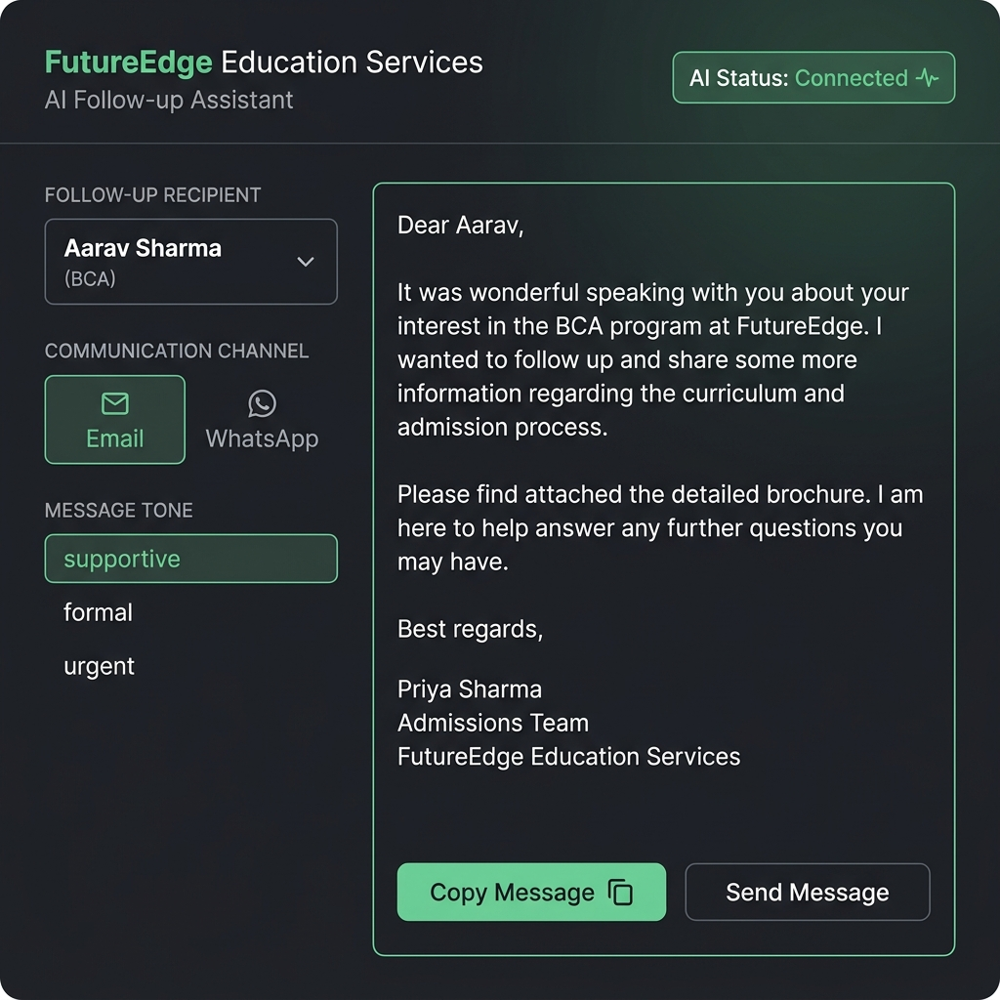
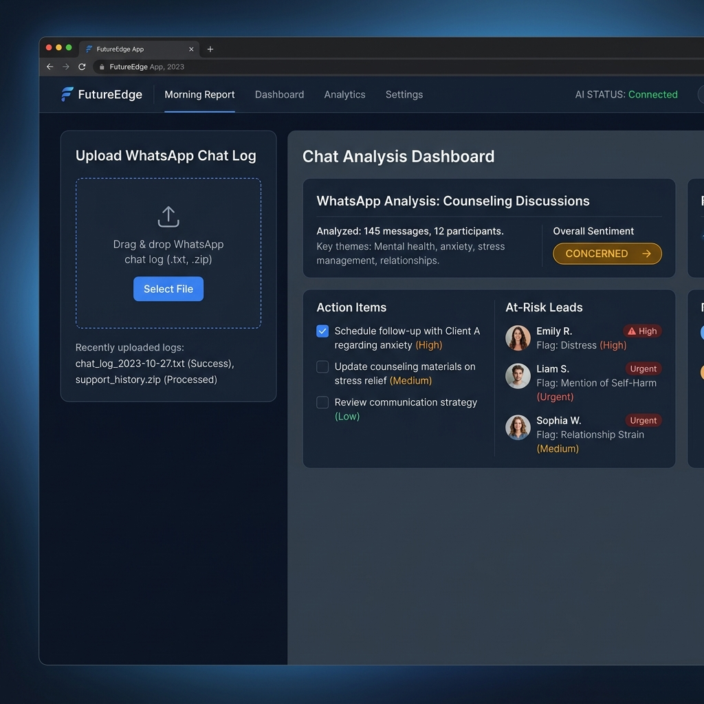
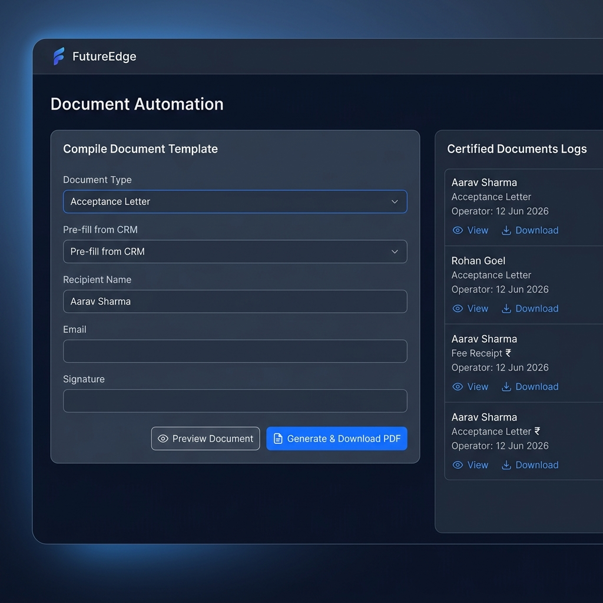

# FutureEdge Operations Suite

[](#)
[](#)
[](#)
[](#)
[](#)

**FutureEdge Operations Suite** is an intelligent educational CRM, admissions workflow automation, and operations manager designed for educational institutes, counseling offices, and academy centers. The platform streamlines student lead acquisition, drafts AI-tailored follow-ups using Google Gemini, syncs counselor chat transcripts, and generates professional PDF letters and receipts.

---

## Architecture Diagram



---

## Tech Stack

* **Frontend:**
  * **React** (v18) & **TypeScript** — Single Page Application (SPA) structure.
  * **Vite** — High-speed compiler and bundler.
  * **Tailwind CSS** — Sleek dark-mode theme utilizing deep navy (`#060B14`) and electric blue (`#008DDA`) highlights.
  * **Recharts** — Dynamic analytics and lead charts.
* **Backend:**
  * **FastAPI** — High-performance Python REST framework.
  * **SQLAlchemy** & **Pydantic** — ORM schema and data serialization.
  * **PostgreSQL** — Neon Serverless production database.
* **AI & Document Automation:**
  * **Google Gemini API** (via `gemini-2.5-flash`) — Contextual lead follow-ups and WhatsApp transcript analysis.
  * **ReportLab** — On-demand, dynamic PDF letter and receipt compilation.

---

## Screenshots

The following screenshots demonstrate the core user interfaces of the FutureEdge suite:

### 1. Secure Production Sign-in


### 2. Operations Dashboard


### 3. CRM Lead Pipeline


### 4. AI Follow-Up Generator


### 5. Morning Chat Reports


### 6. Document Automation


---

## Environment Variables

### Backend (`/backend/.env`)
Create a `.env` file inside the `backend` directory.

| Variable Name | Purpose | Example |
| :--- | :--- | :--- |
| `DATABASE_URL` | SQLAlchemy connection string | `sqlite:///./futureedge.db` (Local Dev) |
| `JWT_SECRET` | Secret key to encrypt JWT tokens | `openssl rand -hex 32` |
| `JWT_ALGORITHM` | Algorithm for JWT tokens | `HS256` |
| `GEMINI_API_KEY` | Key from Google AI Studio | `AIzaSy...` |
| `BACKEND_CORS_ORIGINS` | Allowed frontend web URLs | `http://localhost:5173` |
| `ENVIRONMENT` | Environment runtime flag | `development` or `production` |

### Frontend (`/frontend/.env.local`)
Create a `.env.local` file inside the `frontend` directory.

| Variable Name | Purpose | Example |
| :--- | :--- | :--- |
| `VITE_API_URL` | Target FastAPI server base address | `http://localhost:8000/api/v1` |

---

## Installation & Local Development

### Prerequisites
* Python 3.10+
* Node.js 18+

### Step 1: Clone and Initialize Backend
1. Navigate to the backend folder:
   ```bash
   cd backend
   ```
2. Create and activate a Python virtual environment:
   ```bash
   python -m venv venv
   source venv/bin/activate
   ```
3. Install dependencies:
   ```bash
   pip install -r requirements.txt
   ```
4. Copy the environment template and configure your parameters:
   ```bash
   cp .env.example .env
   ```
5. Run database migrations and seed default records:
   ```bash
   python seed.py
   ```
6. Start the uvicorn development server:
   ```bash
   ./run.sh
   ```

### Step 2: Initialize Frontend
1. Navigate to the frontend folder:
   ```bash
   cd ../frontend
   ```
2. Install node packages:
   ```bash
   npm install
   ```
3. Copy environment template:
   ```bash
   cp .env.example .env.local
   ```
4. Launch the local dev server:
   ```bash
   npm run dev
   ```

Open `http://localhost:5173` in your browser. Log in as an administrator:
* **Email:** `operations@futureedge.edu`
* **Password:** `admin123`

---

## Deployment Guide

Detailed deployment configurations and remote setups are documented in:
* **[deployment_guide.md](deployment_guide.md)** — Production hosting instructions (Render + Vercel + Neon).
* **[migration_guide.md](backend/migration_guide.md)** — Neon PostgreSQL migration.
* **[healthcheck.md](healthcheck.md)** — UptimeRobot and routing configuration.
